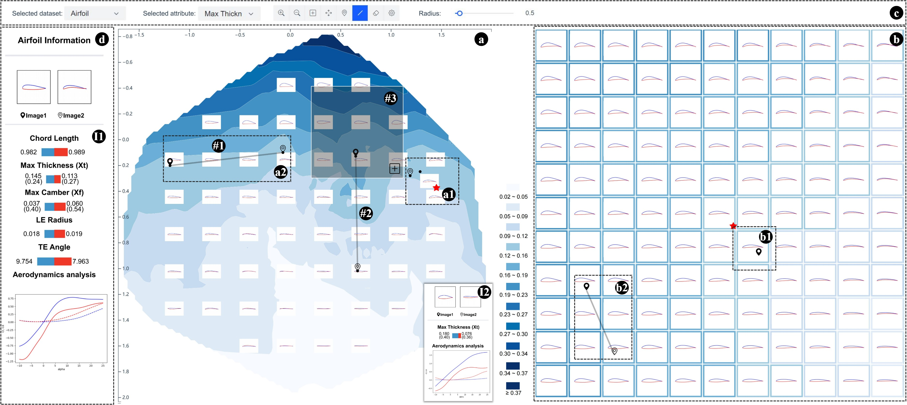

# Latent Space Map for Visual Utilization of Generated Data
> This paper presents Latent Space Map that projects a GLS onto a plane to help users locate regions rich in desirable GSs. Our research revolves around two challenges in constructing the map. First, many GSs in a GLS are low-quality and useless for applications. Excluding them from the projection is challenging for their irregular distribution. We employ a Monte Carlo-based method to capture a manifold for projection, where high-quality GSs are mainly distributed. Second, the GLS is high-dimensional and unbounded, complicating the projection. We design a manifold projection method that endows the map with desirable characteristics to achieve high display accuracy and effective pattern perception for users freely observing the manifold. We further develop a system integrating Latent Space Map to aid in GS selection and refinement. Real-world cases, quantitative experiments, and feedback from domain experts confirm the usability and effectiveness of our approach.

ℹ️ **Info**  
This repository currently contains only part of the full codebase.  
Additional components are not yet included but will be released soon.
